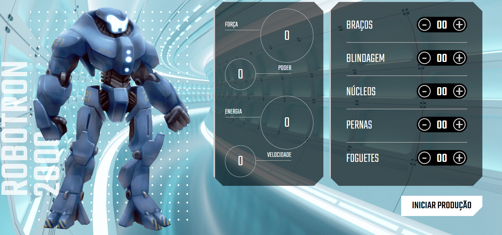

## 💻Projeto

Esse projeto foi desenvolvido durante o curso de javascript : manipulando a DOM na plataforma Alura.

## 🚀Tecnologias

As tecnologias utilizadas nesse curso foram:

 - HTML
 - CSS
 - Javascript
 - Git e GitHub

## 🏷️Layout 

  

